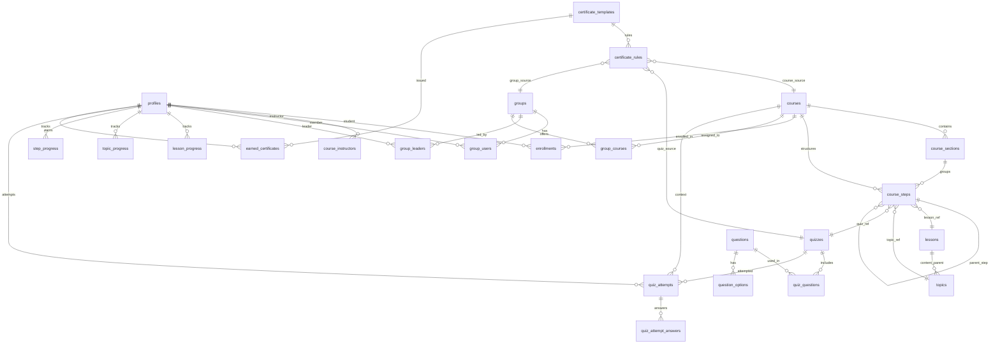

# Phase 2 Schema — LearnDash-Compatible LMS Architecture

## Deliverable A — Architecture Review

### What the existing Phase 1 model does well

| Area | Current behavior |
|------|------------------|
| **Auth & roles** | Supabase Auth + `profiles.role` (`admin`, `instructor`, `student`) with middleware and server-side `requireRole()`. |
| **Courses** | Dedicated `courses` table with slug, status, thumbnail, `wordpress_course_id`. |
| **Instructors** | Many-to-many via `course_instructors`. |
| **Enrollments** | `enrollments` with status lifecycle and Stripe / WordPress legacy fields. |
| **Progress** | `lesson_progress` per student + lesson + course. |
| **Stripe** | Customer linking, checkout webhook, optional subscription sync. |
| **RLS** | Enabled on all Phase 1 tables with SECURITY DEFINER helpers. |

Phase 1 is a **valid foundation** for authentication, payments, and basic course delivery. It is **not** a faithful LearnDash content model.

---

### Where Phase 1 conflicts with LearnDash

| LearnDash concept | Phase 1 representation | Problem |
|-------------------|------------------------|---------|
| **Section** (organizational heading) | `modules` table | Phase 1 migration incorrectly treated sections as modules and **embedded lessons inside modules**. LearnDash sections are headings only. |
| **Lesson** (reusable content CPT) | `lessons` with required `course_id`, `module_id`, `sort_order` | Hierarchy and placement are **baked into the lesson row**. Shared steps across courses are impossible without duplication. |
| **Topic** (child of lesson) | *Missing* | Topics were flattened or ignored. |
| **Course builder tree** | *Missing* | No representation of `Course → Lesson → Topic → Quiz` nesting. |
| **Quiz / Question** | Placeholder UI only | No tables. |
| **Certificate** | Placeholder UI only | No template / rule / earned separation. |
| **Group** | *Missing* | No groups, leaders, or group-course assignments. |
| **Enrollment source** | Implicit (Stripe webhook only) | Cannot distinguish manual, group, migration, admin grants. |
| **Progression rules** | Hard-coded "Lifetime" in UI | No `linear` vs `free_form` course settings. |

---

### What should change (Phase 2)

1. Introduce **`course_sections`** as the LearnDash section entity (headings only).
2. Decouple **`lessons`** (and new **`topics`**, **`quizzes`**) from course placement — content tables hold metadata only.
3. Introduce **`course_steps`** as the course builder / tree — placement, parent, section, sort order, required flag.
4. Add full **assessment** model: quizzes, questions, options, attempts, answers.
5. Add **certificate** model: templates, rules, earned records.
6. Add **group** model: groups, users, leaders, courses (relationship-based leadership).
7. Extend **enrollments** with `enrollment_source` and optional `source_reference`.
8. Extend **courses** with progression rules and Stripe product/price mapping.
9. Complement **`lesson_progress`** with **`topic_progress`** and **`step_progress`** (course-scoped step completion).

---

### What should remain unchanged

| Asset | Reason |
|-------|--------|
| `profiles`, `auth.users` trigger | Production users already exist. |
| `courses` core columns + `wordpress_course_id` | Imported LearnDash courses reference these IDs. |
| `course_instructors` | Independent of LearnDash groups; still valid for app instructors. |
| `enrollments` table + unique `(student_id, course_id)` | Phase 1 enrollments and Stripe webhook logic depend on it. |
| `lesson_progress` | Phase 1 lesson viewer writes here; retained during transition. |
| `subscriptions` | Legacy subscription customers; do not recreate Stripe customers. |
| All existing **`wordpress_*`** legacy columns | Required for reconciliation and rollback. |
| **`modules` table** | **Not dropped.** Deprecated; rows copied to `course_sections` with **same UUIDs** for zero-downtime backfill. |

---

### Migration impact summary

- **Non-destructive**: Phase 2 migration only **adds** tables/columns and **backfills** `course_sections` + `course_steps` from existing data.
- **Phase 1 UI** continues reading `modules` + `lessons` by `course_id` until application routes migrate to `course_steps`.
- **LearnDash importer** (future) writes content tables + `course_steps`; does not duplicate lessons per course.

---

## Deliverable B — ER Model



---

## Deliverable C — Supabase Schema Proposal

### Polymorphic reference strategy

**Rejected:** `step_type + step_id UUID` without FK enforcement — PostgreSQL cannot validate targets.

**Chosen:** Typed nullable FK columns on `course_steps` with a `CHECK` constraint ensuring exactly one content reference matches `step_type`:

```sql
step_type IN ('lesson', 'topic', 'quiz')
lesson_id / topic_id / quiz_id  -- exactly one non-null matching step_type
```

Same pattern for `certificate_rules.source_type` and `earned_certificates` source columns.

---

### Progress model tradeoff

| Approach | Pros | Cons |
|----------|------|------|
| Keep only `lesson_progress` | Simple | Ignores topics, quizzes, shared steps |
| Separate `lesson_progress` + `topic_progress` | LearnDash-aligned | Quiz completion needs another table |
| Generic `step_progress(course_step_id)` | One model for all step types; shared steps tracked per course placement | Indirect join for content details |

**Decision:** Keep **`lesson_progress`** (Phase 1 compat) + add **`topic_progress`** + add **`step_progress`** keyed by `(student_id, course_step_id)` as the canonical course-tree completion record going forward.

---

### Group enrollment strategy

**Recommended:** **Materialized enrollments** with `enrollment_source = 'group'` and `source_reference = group.id`.

| Approach | Verdict |
|----------|---------|
| Derived access (join group_users + group_courses at query time) | Correct but complicates RLS and every access check |
| Materialized enrollments | Safer for RLS; matches LearnDash effective access; auditable |

Future group sync job/trigger creates or revokes enrollments when membership changes. Stripe and group enrollments remain distinguishable via `enrollment_source`.

---

### New tables

See migration file `supabase/migrations/20260901000000_phase2_learndash_schema.sql` for full DDL.

| Table | Purpose |
|-------|---------|
| `course_sections` | LearnDash section headings |
| `topics` | Topic content (reusable) |
| `course_steps` | Course builder tree / placement |
| `quizzes` | Quiz definitions |
| `questions` | Question bank |
| `question_options` | MCQ / T-F options |
| `quiz_questions` | Quiz ↔ question join |
| `quiz_attempts` | Student attempts |
| `quiz_attempt_answers` | Per-question answers (JSONB) |
| `certificate_templates` | Certificate designs |
| `certificate_rules` | Eligibility rules |
| `earned_certificates` | Issued certificates |
| `groups` | LearnDash groups |
| `group_users` | Group membership |
| `group_leaders` | Group leadership (relationship-based) |
| `group_courses` | Courses assigned to groups |
| `topic_progress` | Topic completion |
| `step_progress` | Generic course step completion |

### Altered tables

| Table | Additions |
|-------|-----------|
| `courses` | `excerpt`, `progression_type`, `stripe_product_id`, `stripe_price_id` |
| `lessons` | `excerpt`, `status`; `course_id`/`module_id`/`sort_order` retained (deprecated) |
| `enrollments` | `enrollment_source`, `source_reference`, `stripe_payment_intent_id`, `stripe_checkout_session_id` |

### Preserved legacy IDs

All Phase 1 `wordpress_*` columns retained. New nullable legacy columns added on new entities.

---

## Backward compatibility & rollback

| Risk | Mitigation |
|------|------------|
| Phase 1 pages query `lessons.course_id` | Columns unchanged; backfill `course_steps` in parallel |
| `modules` vs `course_sections` duplication | Same UUID copy; `modules` kept read-only |
| RLS policy drift | New helpers; existing policies untouched on Phase 1 tables |
| Rollback | Drop Phase 2 tables/columns via down migration; Phase 1 data intact |

---

## Application domain layout (Phase 2+)

```text
features/
  courses/       # course + section + step queries
  lessons/       # lesson content CRUD
  topics/        # topic content CRUD
  quizzes/       # quiz + attempt domain
  questions/     # question bank
  groups/        # group membership + access sync
  certificates/  # templates, rules, issuance
  enrollments/   # source-aware enrollment
  progress/      # step / lesson / topic progress
```

UI implementation deferred to Phase 3.
